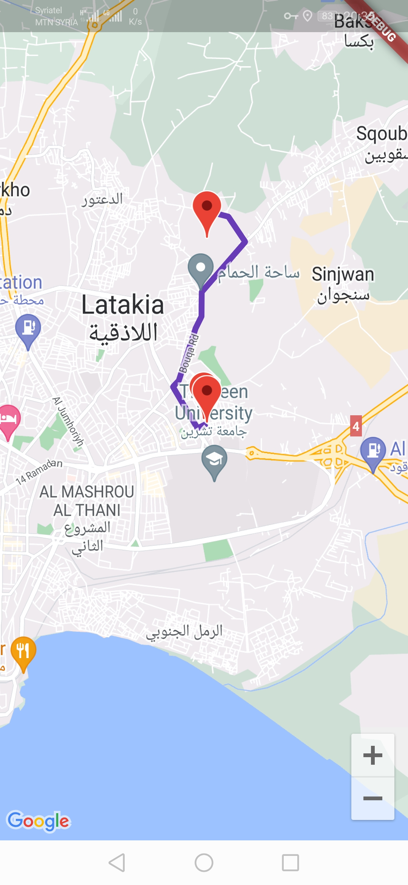
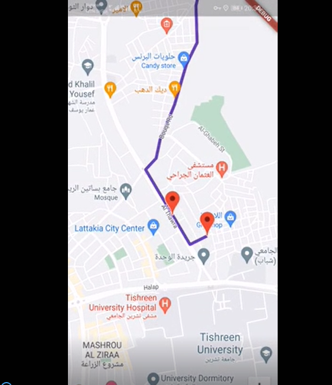

# tracking

A new Flutter project .

 

## How it works

* This project is example for Google map with realtime tracking.

add dependencies :

google_map_flutter :  get api key - enable maps sdk for android and ios - enable directions api

flutter_polyline_points : (getRouteBetweenCoordinates)method to get points and add them to map to draw the route between source and destination 

location : (getLocation)method return location- (onLocationChanged.listen) callback  get continuous callbacks when position is changing and update marker on map

dont forget to add necessary permissions.
 
## To see other projects developed by me :

- [Portfolio](https://nadeemze.github.io/Portfolio/)
